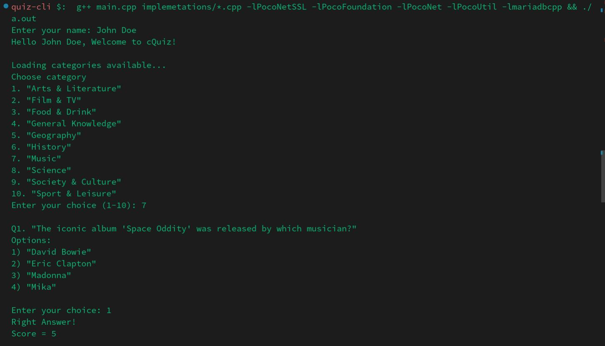
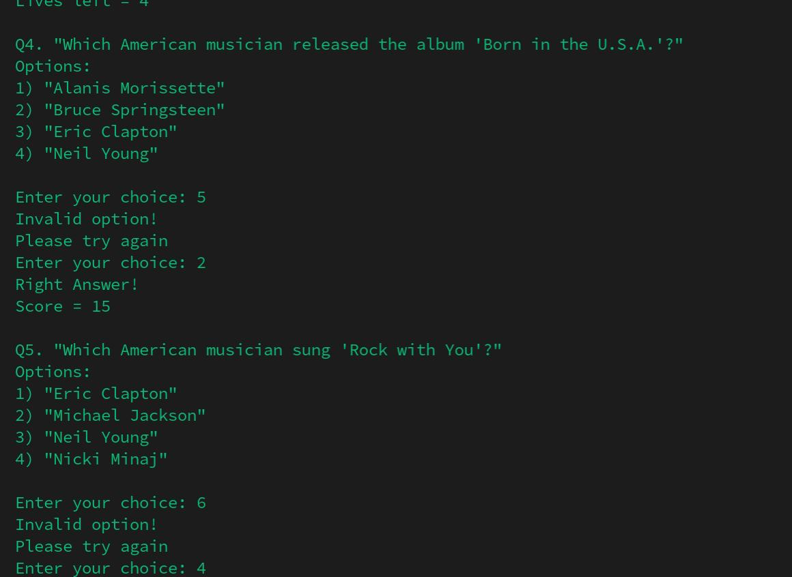
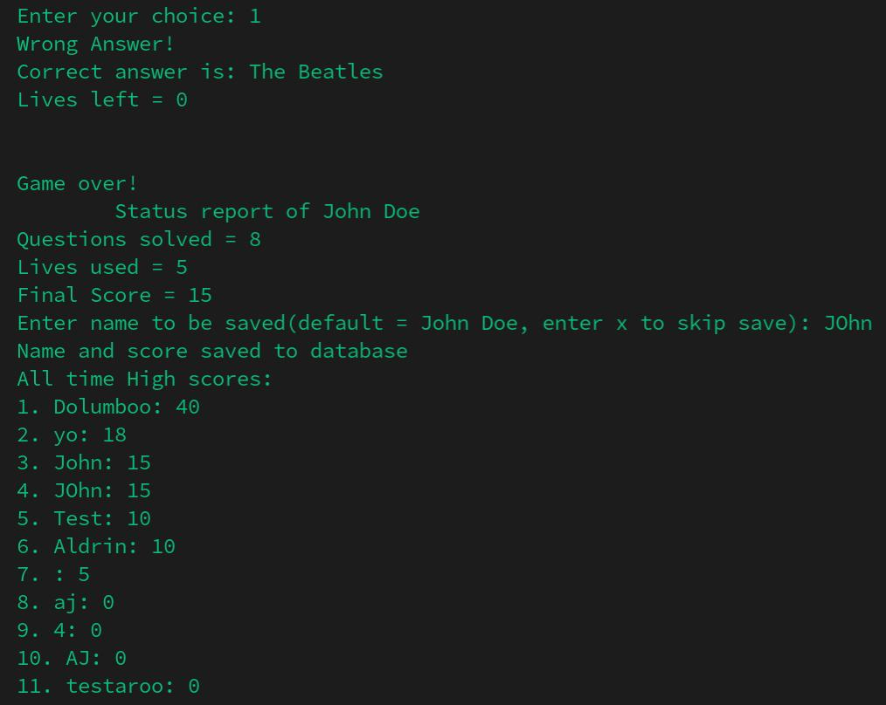

# C-Quiz

Terminal based quiz application with category based quizzing and SQL Database connectivity!

## Features

- fetch categories by making API request from https://the-trivia-api.com/
- make request using selected category and get list of questions in JSON format
- Database connectivity to save and view high scores using MariaDb
- modularised codebase using header and implementation files

## Screenshots


<br/>



## Libraries used

- [nlohmann/json](https://github.com/nlohmann/json)
- [mariadb connector](https://github.com/mariadb-corporation/mariadb-connector-cpp)
- [poco](https://github.com/pocoproject/poco)

## Usage

- Install and Start mariaDb

```bash
 sudo systemctl start mariadb
```

- clone this repository
- install the libraries based on your package manager
- connect using the db username and password. [Ref](https://mariadb.com/docs/connect/programming-languages/cpp/connect/)
- navigate to project root
- compile and link cpp files using g++

```bash
 g++ main.cpp implemetations/*.cpp -lPocoNetSSL -lPocoFoundation -lPocoNet -lPocoUtil -lmariadbcpp
```

- Ensure that you have internet connectivity

- start program

```bash
./a.out
```

### Note: these commands are tested just in Arch Linux for now. There may be slight modifications needed for the commands specific to your OS.
